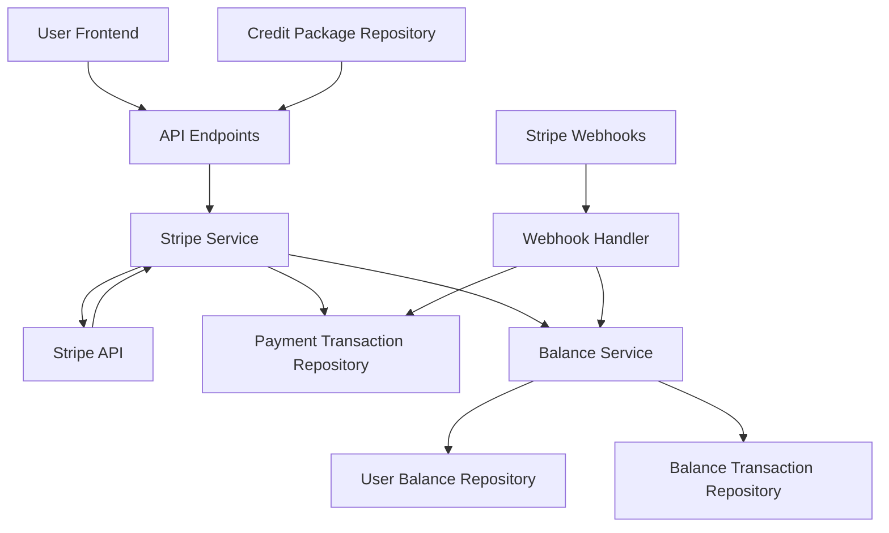

# Stripe Integration Architecture

## 1. Overview

The Stripe integration will allow users to purchase credits for LLM usage through secure payment processing. The architecture will integrate with the existing user balance system and provide webhook support for payment events.

## 2. Architecture Diagram



## 3. Component Design

### 3.1 Stripe Service

The Stripe service will be the core component responsible for:

1. Creating payment intents for credit purchases
2. Handling payment confirmation
3. Integrating with the balance service to add credits
4. Recording payment transactions

```typescript
// src/lib/server/stripe/stripeService.ts
export class StripeService {
  constructor(
    private paymentTransactionRepository: IPaymentTransactionRepository,
    private creditPackageRepository: ICreditPackageRepository,
    private balanceService: BalanceService
  ) {}

  // Create a payment intent for credit purchase
  async createPaymentIntent(
    userId: string,
    creditPackageId: string,
    paymentMethodId?: string
  ): Promise<{ clientSecret: string; paymentIntentId: string }> {
    // Implementation details
  }

  // Handle successful payment
  async handleSuccessfulPayment(
    paymentIntentId: string,
    stripeCustomerId?: string,
    stripePaymentMethodId?: string
  ): Promise<void> {
    // Implementation details
  }

  // Get available credit packages
  async getCreditPackages(): Promise<CreditPackage[]> {
    // Implementation details
  }
}
```

### 3.2 Webhook Handler

The webhook handler will process Stripe events and update the system accordingly:

1. Handle payment success events
2. Handle payment failure events
3. Handle dispute events
4. Update payment transaction status
5. Update user balances when appropriate

```typescript
// src/lib/server/stripe/webhookHandler.ts
export class StripeWebhookHandler {
  constructor(
    private paymentTransactionRepository: IPaymentTransactionRepository,
    private balanceService: BalanceService
  ) {}

  // Handle Stripe webhook events
  async handleWebhookEvent(event: Stripe.Event): Promise<void> {
    // Implementation details
  }
}
```

### 3.3 Integration with Existing Balance Service

The Stripe service will integrate with the existing BalanceService to add credits to user accounts:

1. When a payment is successful, credits are added to the user's balance
2. A balance transaction is recorded for the credit addition
3. The payment transaction is linked to the balance transaction

## 4. Data Flow

### 4.1 Credit Purchase Flow

1. User requests available credit packages
2. User selects a package and initiates payment
3. System creates a Stripe PaymentIntent
4. User completes payment on the frontend
5. Stripe sends webhook confirmation
6. System updates user balance with purchased credits
7. System records payment transaction
8. User receives confirmation

### 4.2 Webhook Processing Flow

1. Stripe sends event to webhook endpoint
2. System validates webhook signature
3. System processes event based on type
4. System updates payment transaction status
5. System updates user balance if needed
6. System sends response to Stripe

## 5. Security Considerations

1. All Stripe API calls will use secret keys (never exposed to frontend)
2. Webhook endpoints will validate Stripe signatures
3. Payment intents will be linked to specific users
4. All database operations will use proper authentication
5. Sensitive data will be encrypted where appropriate