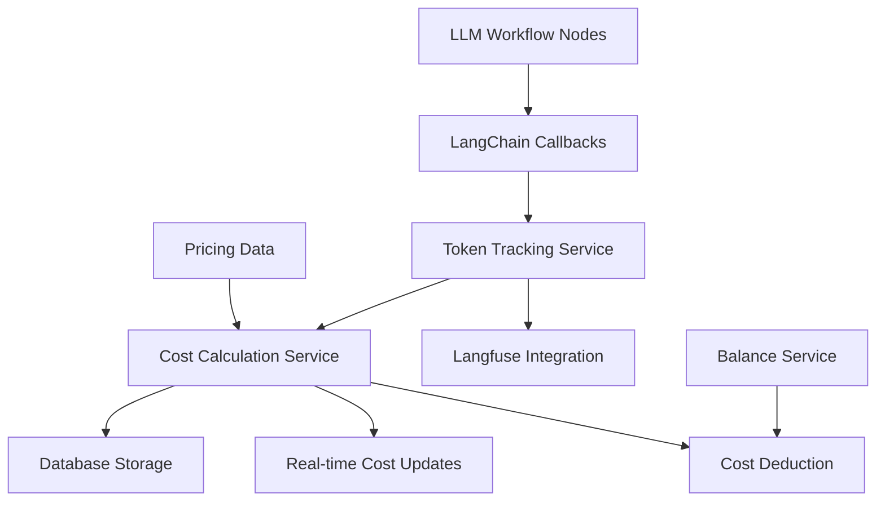
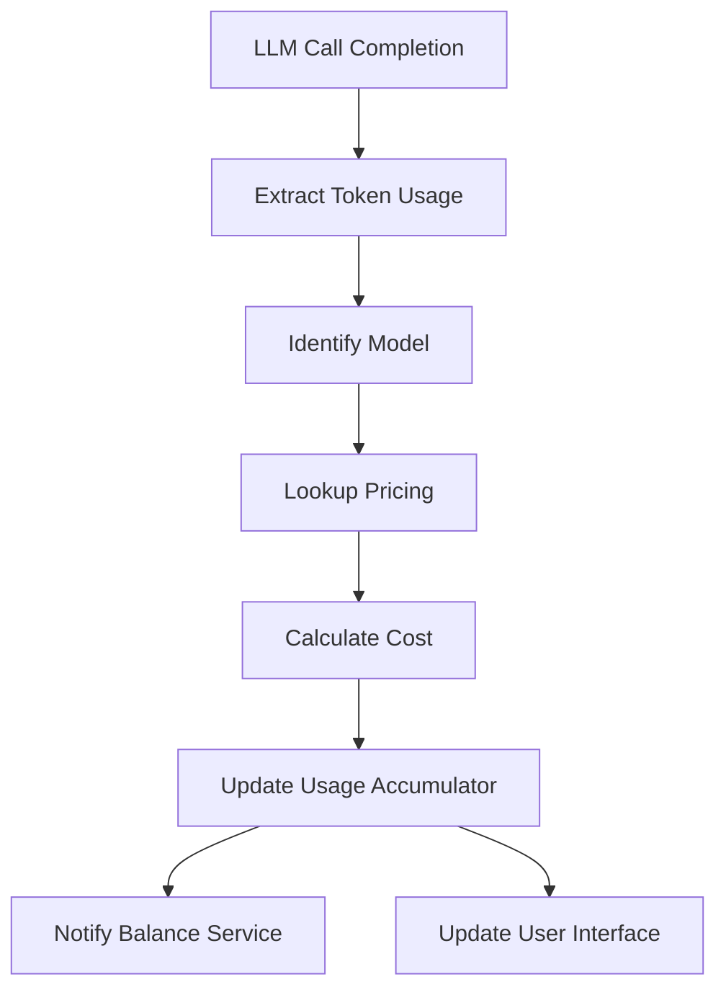

# Technical Specification: Real Token Usage Tracking and Cost Calculation System

## 1. Overview

This document outlines the technical specification for implementing a real token usage tracking and cost calculation system for LLM calls. The system will track actual token usage for each LLM call, calculate real costs based on provider rates, and integrate with the existing LangChain.js and Langfuse setup.

## 2. Requirements

1. Track actual token usage for each LLM call (input tokens and output tokens)
2. Calculate real costs based on provider rates (OpenAI pricing)
3. Store usage data for billing and monitoring purposes
4. Provide real-time cost calculation during analysis
5. Integrate with the existing LangChain.js and Langfuse setup
6. Support for different models with different pricing
7. Handle edge cases like failed LLM calls

## 3. Architecture Design



### 3.1. Key Components

1. **Token Tracking Service**: Captures token usage from LLM calls via LangChain callbacks
2. **Cost Calculation Service**: Calculates costs based on token usage and current pricing
3. **Data Storage Layer**: Stores token usage and cost data in the database
4. **Integration Layer**: Works with existing LangChain.js callback system and Langfuse tracing

## 4. Integration Points

### 4.1. LangChain.js Integration
- **Callback System**: Leverage the existing callback mechanism to capture token usage
  - Use `handleLLMEnd` method to extract token counts from LLM responses
  - Access `tokenUsage` information from the LLM result object
  - Associate usage with the current analysis session

- **Model Information**: Extract model details from LLM configurations
  - Access `modelName` from ChatOpenAI instances
  - Use model information for pricing calculations

### 4.2. Langfuse Integration
- **Trace Correlation**: Associate token usage with specific Langfuse traces
  - Use existing `langfuseHandler` to link usage data with traces
  - Leverage trace IDs for querying and reporting

- **Observability**: Enhance existing tracing with cost information
  - Add cost metadata to Langfuse observations
  - Provide visibility into token consumption per operation

### 4.3. Workflow Integration
- **Session Context**: Pass analysis session information through workflow state
  - Add analysis ID to workflow state for correlation
  - Associate usage with specific user sessions

- **Real-time Updates**: Provide cost updates during workflow execution
  - Update cost information after each node completion
  - Make real-time cost available to the balance service

## 5. Data Structures

### 5.1. Database Schema Extension

```sql
-- Token usage tracking table
CREATE TABLE token_usage (
  id UUID PRIMARY KEY DEFAULT gen_random_uuid(),
  user_id UUID NOT NULL REFERENCES users(id) ON DELETE CASCADE,
  analysis_id UUID NOT NULL,
  model_name TEXT NOT NULL,
  input_tokens INTEGER NOT NULL,
  output_tokens INTEGER NOT NULL,
  cost NUMERIC(10, 6) NOT NULL, -- Cost in USD
  timestamp TIMESTAMPTZ NOT NULL DEFAULT NOW(),
  success BOOLEAN NOT NULL DEFAULT TRUE,
  error_message TEXT
);
```

### 5.2. TypeScript Types

```typescript
// Extended TokenUsage interface
export interface TokenUsage {
  id: string;
  userId: string;
  analysisId: string;
  modelName: string;
  inputTokens: number;
  outputTokens: number;
  cost: number; // Dollar amount
  timestamp: Date;
  success: boolean;
  errorMessage?: string;
}

// Pricing information
export interface ModelPricing {
  modelName: string;
  inputTokenPrice: number; // Price per 1000 tokens
  outputTokenPrice: number; // Price per 1000 tokens
  provider: string;
}

// Usage summary for an analysis
export interface AnalysisUsageSummary {
  analysisId: string;
  totalInputTokens: number;
  totalOutputTokens: number;
  totalCost: number;
  modelUsages: {
    modelName: string;
    inputTokens: number;
    outputTokens: number;
    cost: number;
  }[];
}
```

### 5.3. Repository Interface

```typescript
// Token usage repository interface
export interface ITokenUsageRepository extends IBaseRepository<TokenUsage, NewTokenUsage> {
  getByUserId(userId: string): Promise<TokenUsage[]>;
  getByAnalysisId(analysisId: string): Promise<TokenUsage[]>;
  getUsageSummary(analysisId: string): Promise<AnalysisUsageSummary>;
  getCostForAnalysis(analysisId: string): Promise<number>;
}
```

## 6. Real-time Cost Calculation Approach

### 6.1. Cost Calculation Service



### 6.2. Implementation Details

- **Pricing Engine**: A service that maintains current pricing for different models
  - OpenAI GPT-4o-mini: $0.150 / 1M input tokens, $0.600 / 1M output tokens
  - OpenAI GPT-4o: $5.00 / 1M input tokens, $15.00 / 1M output tokens

- **Usage Accumulator**: Tracks cumulative usage for an analysis session
  - Maintains running totals of input/output tokens and costs
  - Provides real-time updates to the balance service

- **Integration with Workflow**: 
  - Associates usage with analysis ID from workflow state
  - Updates cost after each node completion

## 7. Error Handling and Edge Cases

### 7.1. Failed LLM Calls
- **Tracking**: Still record the attempt with `success: false` and error message
- **Cost**: No cost for failed calls, but track for debugging
- **Workflow**: Continue workflow if possible, or gracefully fail

### 7.2. Missing Token Information
- **Fallback**: Use estimated token counts based on input/output length
- **Logging**: Record when actual token counts are unavailable
- **Alerting**: Notify monitoring system of data quality issues

### 7.3. Pricing Lookup Failures
- **Default Pricing**: Use default/fallback pricing for unknown models
- **Caching**: Cache pricing data to reduce dependency on external services
- **Updates**: Periodically refresh pricing data

### 7.4. Database Storage Failures
- **Buffering**: Temporarily buffer usage data in memory
- **Retry Logic**: Implement retry mechanisms for storage failures
- **Fallback Logging**: Log to file system if database is unavailable

### 7.5. Network Issues
- **Timeouts**: Implement reasonable timeouts for external services
- **Circuit Breaker**: Prevent cascading failures
- **Graceful Degradation**: Continue operation with reduced functionality

### 7.6. Other Edge Cases
- **Invalid Model Names**: Validate and handle unknown models
- **Rate Limiting**: Handle API rate limits
- **Partial Failures**: Isolate failures to prevent cascading issues
- **Zero Token Usage**: Handle edge cases with no token consumption
- **Concurrent Usage**: Manage multiple simultaneous analyses

## 8. Performance Considerations

### 8.1. Minimal Overhead
- **Non-blocking Operations**: All tracking operations should be non-blocking
- **Callback Integration**: Use existing LangChain callbacks without adding significant processing
- **Efficient Data Extraction**: Minimize processing of LLM response data

### 8.2. Asynchronous Operations
- **Background Processing**: Store usage data asynchronously to avoid blocking LLM calls
- **Event-driven Updates**: Use event-driven architecture for real-time updates
- **Deferred Aggregation**: Aggregate usage data periodically rather than after each call

### 8.3. Batching
- **Batch Database Writes**: Batch token usage records for efficient database writes
- **Bulk Operations**: Use bulk insert operations when storing multiple records
- **Queue Management**: Implement queuing mechanism for batch processing

### 8.4. Caching
- **Pricing Cache**: Cache model pricing information to avoid repeated lookups
- **User Balance Cache**: Cache user balance information for quick access
- **TTL Strategy**: Implement time-to-live for cached data to ensure freshness

### 8.5. Database Performance
- **Indexing**: Create appropriate indexes for querying usage data
- **Partitioning**: Consider partitioning large usage tables by date
- **Connection Pooling**: Use connection pooling for database operations

## 9. Testing Strategy

### 9.1. Unit Tests

#### Cost Calculation Service
- Test cost calculation with different models and token counts
- Test pricing lookup with valid and invalid model names
- Test edge cases (zero tokens, very large token counts)
- Test currency precision and rounding

#### Token Tracking Service
- Test token extraction from LLM responses
- Test association with analysis sessions
- Test error handling for malformed responses

#### Balance Integration
- Test cost deduction from user balances
- Test insufficient balance scenarios
- Test balance updates after successful deductions

### 9.2. Integration Tests

#### LangChain.js Integration
- Test callback integration with actual LLM calls
- Test token extraction from different LLM providers
- Test integration with different model types

#### Langfuse Integration
- Test trace correlation with token usage
- Test metadata addition to observations
- Test error handling in tracing

#### Database Integration
- Test storage of token usage records
- Test querying of usage data
- Test aggregation functions
- Test error handling for database failures

### 9.3. End-to-End Tests

#### Complete Workflow
- Test full analysis workflow with token tracking
- Test cost accumulation across multiple LLM calls
- Test real-time cost updates during analysis
- Test final cost deduction from user balance

#### Error Scenarios
- Test workflow with failed LLM calls
- Test workflow with partial failures
- Test workflow with network issues

### 9.4. Performance Tests

#### Latency Impact
- Measure latency impact of tracking system on LLM calls
- Test performance under concurrent analyses
- Test memory usage during long-running analyses

#### Scalability
- Test system performance with increasing load
- Test database performance with large usage datasets
- Test caching effectiveness

### 9.5. Error Handling Tests

#### LLM Call Failures
- Test tracking of failed LLM calls
- Test cost calculation when calls fail
- Test workflow continuation after failures

#### Data Issues
- Test handling of missing token information
- Test handling of invalid model names
- Test handling of malformed responses

### 9.6. Edge Case Tests

#### Boundary Conditions
- Test with zero token usage
- Test with maximum token limits
- Test with very long-running analyses

#### Concurrent Usage
- Test multiple concurrent analyses for same user
- Test overlapping analyses with different users
- Test race conditions in balance updates